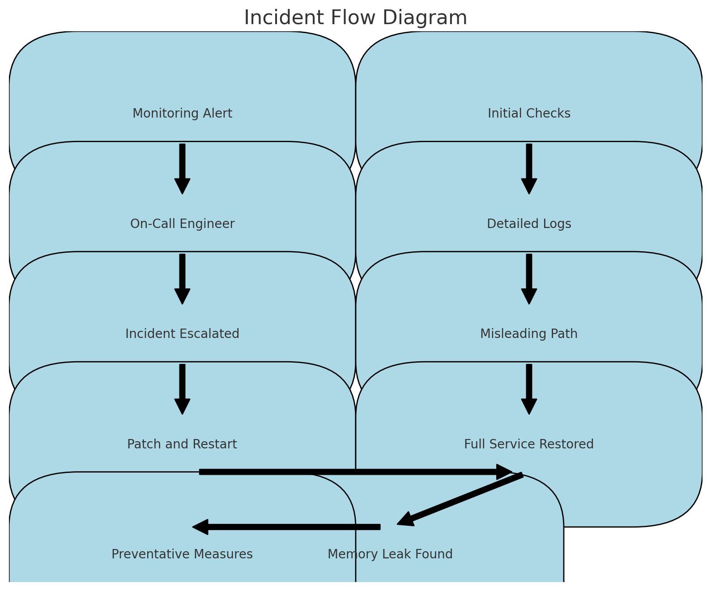

# Postmortem Report: The Great Payment Meltdown of 2024

---

*Let's dive into the tale of the not-so-fantastic voyage of our payment gateway that took our e-commerce service on a two-and-a-half-hour hiatus. Think of it as the "Titanic" of tech glitches, but with fewer icebergs and more memory leaks.*

---

## Issue Summary

**Duration of Outage:** June 20, 2024, 14:00 UTC to June 20, 2024, 16:30 UTC

**Impact:** Our beloved e-commerce service took a coffee break right when our users needed it the most. Imagine trying to buy your dream gadget, only to find the checkout button giving you the cold shoulder. That's what 75% of our users faced—slow page loads and failed payment processing. Not cool.

**Root Cause:** A sneaky memory leak in our payment gateway integration. Picture it like a leaky faucet that kept filling up until the whole server drowned in its own inefficiency.

---

## Timeline

- **14:00 UTC:** Monitoring alert goes off like a fire alarm in a popcorn factory. Error rates and slow response times skyrocketing.
- **14:05 UTC:** Our on-call engineer, let's call him "Captain Debug," rushes in to save the day.
- **14:10 UTC:** Initial thought: "Must be those darn traffic spikes!" But nope, it was a quiet day in traffic land.
- **14:20 UTC:** Traffic logs reviewed, no suspicious activity. Captain Debug's detective senses tingle.
- **14:30 UTC:** Server logs reveal high memory usage. Aha! The plot thickens.
- **14:40 UTC:** Incident escalated to the A-Team—our ace developers behind the payment gateway.
- **15:00 UTC:** Misleading trail: Recent deployments checked but all clear. The memory leak lurks in the shadows.
- **15:20 UTC:** Detailed memory profiling begins. Captain Debug and the A-Team zero in on the payment gateway module.
- **15:40 UTC:** Gotcha! Memory leak identified. Time for the fix.
- **16:00 UTC:** Quick patch: Servers restarted to kick out the rogue memory hog.
- **16:30 UTC:** Full service restored. Captain Debug and the A-Team get their much-deserved victory snacks.

---

## Root Cause and Resolution

**Root Cause:** The issue was traced to a memory leak within the payment gateway integration module. Think of it as a forgetful librarian who never puts the books back on the shelves, causing a chaotic pileup. Each transaction left a bit of memory hanging around, and soon enough, the server was buried under a mountain of unused memory.

**Resolution:** Our A-Team rolled out a patch faster than you can say "memory management." They ensured that memory was properly released after each transaction. The fix was thoroughly tested in our staging environment (we're not falling for that one again) before being deployed to production. A quick server restart kicked the problem to the curb, and normal service resumed.

---

## Corrective and Preventative Measures

**Improvements:**
1. **Code Review:** Step up our code review game to catch memory mismanagement before it goes live.
2. **Monitoring Enhancements:** Boost our monitoring tools to catch memory leaks early and sound the alarm before things go haywire.
3. **Load Testing:** Regularly put our system through its paces to spot potential performance hiccups in a controlled environment.

**Task List:**
1. **Patch Nginx Server:** Fine-tune Nginx server configurations to better handle memory usage.
2. **Add Monitoring on Server Memory:** Implement detailed memory monitoring for all critical modules, especially the payment gateway.
3. **Review and Refactor Payment Gateway Code:** Conduct a deep dive into the payment gateway code to root out any other lurking issues.
4. **Deploy Automated Tests:** Create automated tests specifically designed to catch memory leaks and other performance issues during development.
5. **Update Incident Response Plan:** Revise our incident response plan to include specific steps for handling memory leaks and similar shenanigans.

---

## Incident Flow Diagram

This visual representation helps clarify the sequence of events and the resolution process.

---

*Remember, in the world of tech, even the tiniest leak can sink a ship. But with a great team and a solid plan, no challenge is insurmountable.*

